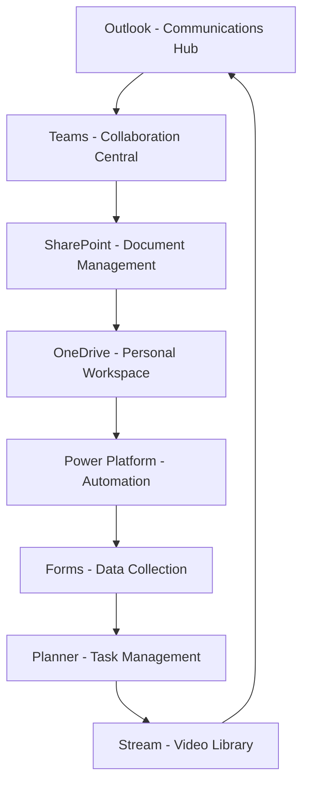

# Office 365 for HR: Complete Integration & Productivity Guide

## 🌟 Platform Overview
**Suite**: Microsoft 365 | **Focus**: HR Productivity | **Integration Level**: Advanced

---

## 🗺️ Your HR Digital Ecosystem

### Core Apps for HR Success



---

## 🔄 Module 1: Seamless App Integration

### The HR Power Workflow

#### Scenario: New Employee Onboarding

**Step 1: Forms** (Data Collection)
```
New Hire Form captures:
- Personal information
- Emergency contacts
- Tax withholding
- Direct deposit
- Equipment needs
```

**Step 2: Power Automate** (Process Automation)
```
Triggered actions:
1. Create employee folder in SharePoint
2. Send welcome email via Outlook
3. Create tasks in Planner
4. Schedule orientation in Teams
5. Add to AD/Azure groups
```

**Step 3: SharePoint** (Document Management)
```
Auto-generated structure:
/Employees/[EmployeeID]/
  ├── Onboarding/
  ├── Benefits/
  ├── Performance/
  └── Training/
```

**Step 4: Teams** (Collaboration)
```
Automated additions:
- HR Team channel notification
- IT Support ticket
- Buddy assignment message
- Calendar invites sent
```

### Cross-App Data Flow

```yaml
Forms Entry → Power Automate → SharePoint List
     ↓              ↓                ↓
  Outlook      Teams Post      Planner Task
     ↓              ↓                ↓
Calendar Event   Meeting      Progress Tracking
```

---

## 📊 Module 2: Power Platform for HR

### Power Apps: Custom HR Solutions

#### Employee Self-Service Portal

**Features**:
- View pay stubs
- Request time off
- Update personal info
- Access benefits
- Submit IT requests

**Building Steps**:
1. **Power Apps** → **Create** → **Canvas app**
2. Connect to data:
   - SharePoint lists
   - SQL database
   - Dataverse
3. Design screens:
   - Login/Authentication
   - Dashboard
   - Forms
   - Reports

#### Mobile Time Clock App

```javascript
Screen: Clock In/Out
- GPS location capture
- Photo verification
- Shift selection
- Break tracking
- Overtime alerts
```

### Power BI: HR Analytics Dashboard

#### Key HR Metrics Visualizations

**Dashboard Components**:
```
┌─────────────┬─────────────┬─────────────┐
│ Headcount   │ Turnover    │ Time-to-Fill│
│ KPI Card    │ Trend Line  │ Gauge Chart │
├─────────────┴─────────────┼─────────────┤
│ Demographics              │ Salary Dist │
│ Donut Charts              │ Box Plot    │
├───────────────────────────┼─────────────┤
│ Department Metrics        │ Filters     │
│ Matrix Visual             │ Slicers     │
└───────────────────────────┴─────────────┘
```

**Data Sources**:
- HRIS systems
- SharePoint lists
- Excel reports
- SQL databases
- Forms responses

### Power Virtual Agents: HR Chatbot

**Common HR Bot Scenarios**:

```
Employee: "How many vacation days do I have?"
Bot: Checking your balance... You have 12 days remaining.

Employee: "How do I add a dependent?"
Bot: Here's the process: [Shows step-by-step guide]
     Would you like me to start the form for you?

Employee: "When is open enrollment?"
Bot: Open enrollment runs from Oct 15 - Nov 15.
     [Shows countdown] 23 days remaining.
```

---

## 🔐 Module 3: Security & Compliance

### Information Governance

#### Sensitivity Labels for HR

**Label Structure**:
```
Public
├── General announcements
└── Policy summaries

Internal Use Only  
├── Procedures
├── Phone lists
└── Org charts

Confidential - HR
├── Employee files
├── Salary data
└── Performance reviews

Highly Confidential - HR
├── Investigations
├── Medical records
└── Legal matters
```

**Auto-labeling Rules**:
- Contains SSN → Highly Confidential
- Contains "salary" → Confidential
- Contains "policy" → Internal

### Data Loss Prevention (DLP)

**HR-Specific DLP Policies**:

1. **Block External Sharing**:
   - Employee records
   - Compensation data
   - Investigation files

2. **Encryption Required**:
   - Benefits enrollment
   - Tax documents
   - I-9 forms

3. **Approval Needed**:
   - Bulk employee data
   - Audit reports
   - Compliance documents

### Retention Policies

```
Document Type          | Retention Period
--------------------- | ----------------
Employment Records     | 7 years after separation
Benefits Records      | 6 years
I-9 Forms            | 3 years after hire or 1 year after separation
Medical Records      | 30 years
Training Records     | 5 years
Email               | 3 years
```

---

## 🌐 Module 4: Modern Workplace Solutions

### Microsoft Viva Integration

#### Viva Insights for HR
```
Manager Dashboard shows:
- Team wellbeing scores
- Meeting effectiveness
- After-hours work trends
- Focus time availability
- 1:1 meeting frequency
```

#### Viva Learning
```
HR Learning Paths:
1. New Manager Training
2. Diversity & Inclusion
3. Performance Management
4. Legal Compliance
5. Leadership Development
```

#### Viva Topics
```
Auto-discovered HR Topics:
- FMLA Process (87 documents)
- Hiring Procedures (134 documents)
- Benefits FAQ (203 documents)
- Remote Work Policy (67 documents)
```

### Microsoft Bookings for HR

**Service Catalog**:
- Benefits consultations (30 min)
- HR office hours (15 min)
- Exit interviews (45 min)
- Career coaching (60 min)
- Policy clarification (15 min)

**Automated Features**:
- Confirmation emails
- Reminder texts
- Calendar blocking
- Teams meeting links
- Post-meeting surveys

---

## 📱 Module 5: Mobile Productivity

### Office Mobile Apps for HR

#### Outlook Mobile
**HR Quick Actions**:
- Approve/Reject with one tap
- Voice dictation for responses
- Calendar RSVP from notification
- Quick meeting scheduling

#### Teams Mobile
**Field HR Features**:
- Remote employee check-ins
- Video interviews on-the-go
- Document scanning
- Shift management
- Instant messaging

#### SharePoint Mobile
**Offline Capabilities**:
- Download HR handbooks
- Access emergency contacts
- View org charts
- Complete checklists

### Microsoft Lens Integration

**HR Use Cases**:
1. Scan paper documents → PDF → SharePoint
2. Business card → Contact creation
3. Whiteboard → Meeting notes
4. Receipt → Expense report

---

## 🤖 Module 6: AI & Automation

### Copilot for HR Tasks

#### Email Assistance
```
Prompt: "Draft a professional response declining a salary negotiation request"
Copilot: Generates empathetic, policy-compliant response
```

#### Document Creation
```
Prompt: "Create a performance improvement plan template"
Copilot: Builds comprehensive PIP with milestones
```

#### Meeting Summaries
```
After HR team meeting:
- Key decisions documented
- Action items assigned
- Follow-up meetings scheduled
- Notes distributed automatically
```

### Advanced Automation Scenarios

#### Automated Compliance Tracking
```
Trigger: Training due date approaching
Actions:
1. Email employee and manager
2. Create calendar reminder
3. Block calendar if overdue
4. Escalate if not completed
5. Update compliance dashboard
```

#### Smart Document Processing
```
Invoice/Receipt → AI extracts data → Auto-categorize → 
Route for approval → Update financial systems → Archive
```

---

## 🛠️ Module 7: Admin & Governance

### Microsoft 365 Admin Center for HR

#### User Management
```powershell
# Bulk create users from HR system
Import-Csv newusers.csv | ForEach {
    New-MsolUser -DisplayName $_.DisplayName `
    -UserPrincipalName $_.UPN `
    -Department $_.Department `
    -UsageLocation "US"
}
```

#### License Management
- Assign licenses based on role
- Track usage and optimize
- Automate via job titles
- Report on compliance

### Compliance Center

**HR Compliance Dashboard**:
- Data subject requests
- Audit log searches
- eDiscovery cases
- Retention policy status
- DLP incident reports

---

## 📈 Module 8: Reporting & Analytics

### Unified Reporting Across Apps

#### HR Metrics Pipeline
```
Source Systems → Power Automate → Data Lake → Power BI
                        ↓
                  SharePoint Lists
                        ↓
                  Excel Reports
```

#### Key Reports for HR

**Weekly Operational**:
- Open positions status
- Interview pipeline
- Onboarding progress
- Time-off requests
- Training compliance

**Monthly Strategic**:
- Headcount analysis
- Turnover trends
- Compensation reviews
- Diversity metrics
- Engagement scores

**Annual Compliance**:
- EEO-1 reporting
- ACA compliance
- OSHA recordables
- Training completion
- Audit findings

---

## 💡 Module 9: Best Practices

### Change Management for Office 365

#### Adoption Strategy
1. **Champions Network**
   - Identify HR power users
   - Provide advanced training
   - Create feedback loops
   - Recognize contributions

2. **Phased Rollout**
   ```
   Phase 1: Email & Calendar
   Phase 2: Teams & SharePoint
   Phase 3: Power Platform
   Phase 4: Advanced Features
   ```

3. **Success Metrics**
   - Active usage rates
   - Process time reduction
   - Error rate decrease
   - User satisfaction

### HR-Specific Governance

**Naming Conventions**:
```
Teams: HR-[Function]-[Year]
Sites: HR-[Department]-[Purpose]
Files: YYYY-MM-DD_[Category]_[Description]
Lists: HR_[Process]_[Version]
```

**Permission Models**:
```
HR Leadership: Full Control
HR Staff: Contribute + Custom
Managers: Read + Limited Edit
Employees: Read Only
External: No Access (default)
```

---

## 🚀 Module 10: Future-Ready HR

### Emerging Technologies

#### Microsoft Mesh for HR
- Virtual reality onboarding
- Immersive training sessions
- Global team building
- 3D policy walkthroughs

#### AI Builder Integration
- Resume parsing
- Sentiment analysis
- Predictive turnover
- Automated scheduling

### Continuous Improvement

**Monthly Review Checklist**:
- [ ] Usage analytics review
- [ ] Process optimization opportunities
- [ ] New feature evaluation
- [ ] Security audit
- [ ] User feedback analysis
- [ ] Training needs assessment

---

## 🎯 Implementation Roadmap

### Month 1: Foundation
- Set up core apps
- Migrate key documents
- Basic training for all

### Month 2: Integration
- Connect apps
- Automate 3 processes
- Advanced user training

### Month 3: Optimization
- Refine workflows
- Add Power Platform
- Measure success

### Month 4+: Innovation
- AI integration
- Advanced analytics
- Continuous improvement

---

## 📞 Support Resources

### Internal Resources
- IT Help Desk: x1234
- HR Tech Team: hrtech@agency.gov
- Training Calendar: [Link]
- User Guides: [SharePoint]

### External Resources
- [Microsoft 365 Training](https://support.microsoft.com)
- [Microsoft Learn](https://learn.microsoft.com)
- [Tech Community](https://techcommunity.microsoft.com)
- [YouTube Tutorials](https://youtube.com/microsoft365)

---

**Document Classification**: Public | **Last Updated**: [Date] | **Next Review**: Quarterly

**Quick Actions**:
- 💾 Save to OneDrive
- 📤 Share via Teams
- 🖨️ Print Quick Reference
- 📧 Email to Team